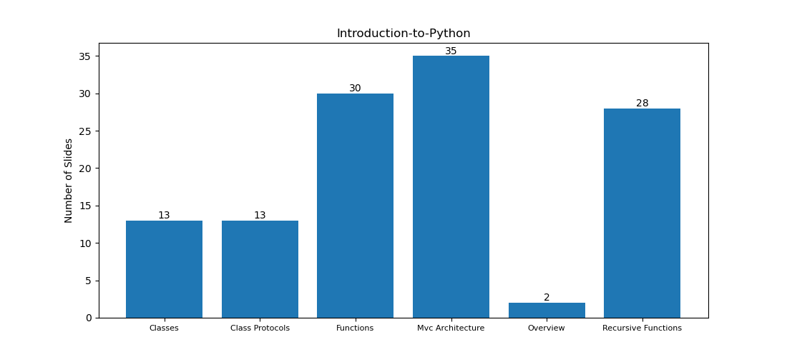
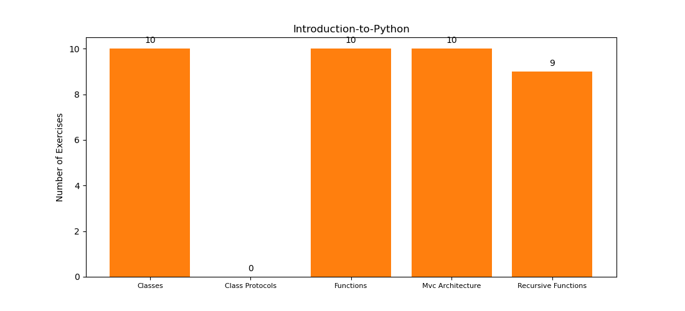

# [Introduction to Python](https://byteacademyco.github.io/Introduction-To-Python/#/)

## Functions
### Basics
* Python Memory Manipulation
* Formal Definition
* Args, Kwargs
### Scope
* Terminology
* Blocks
* LEGB Scope
* Leaky Scope
* `global`, `nonlocal`
### Functional Programming
* Motivation
* `map`
* `filter`
* Lambda Functions
### Complexity Theory
* Definition
* Performance Analysis
* Examples

## Recursive Functions
### Introduction to Recursion
* Definitions
* Sum List
### Complexity Analysis
* Sum List
* Fibonacci
### Interview Problems
* Convert Decimal String to Integer
* Convert Hexadecimal String to Integer

## Object Oriented Programming
### Classes
* Motivation
* Initialization
* Attributes
* Methods
* Inheritance
### Python Features
* Context Managers
* Exceptions
* Modules

## Class Protocols
### Introduction
* What is a Protocol
* Python Protocols
### Common Protocols
* Length
* Print
* Arithmetic
* Comparison
* Index/Slice
* Others

## MVC Architecture
### Design Patterns
* What are they?
* Lots of them!
### MVC
* Overview
* What does it stand for?
* Model
* View
* Controller
### Example
* Terminal Teller
* Model
* View
* Controller
* Running it
